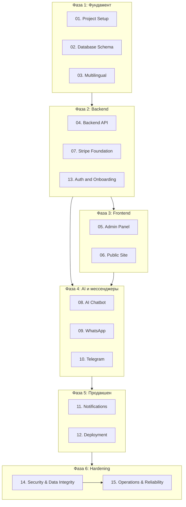

# План разработки сервиса бронирования с AI-чатботом

## Обзор проекта

Веб-сервис для автоматизации записи клиентов в малый бизнес (маникюрные студии, парикмахерские, автомастерские, частные врачи). AI-чатбот в WhatsApp и Telegram, админ-панель для настройки, мультиязычность (итальянский, английский), хостинг на Railway.

**Ключевые решения:**
- Railway — хостинг
- Италия — первый рынок
- Мультитенантность: несколько бизнесов в одном приложении
- Поддомены: `{slug}.yourapp.com` для публичного сайта
- Регистрация администратора (email + пароль), при signup создаётся tenant
- Подтверждение записи вручную администратором (pending → confirmed)
- Мультиязычность с первого дня (словари)
- OpenAI — движок чатбота
- Stripe — заложен как основа, MVP без оплаты (только запись)
- Админка: мастера, услуги, часы работы, длительность услуг — всё настраивается

---

## Этапы разработки

| # | Этап | Файл | Краткое описание |
|---|------|------|------------------|
| 01 | Project Setup & Infrastructure | [01-project-setup.md](01-project-setup.md) | Monorepo, Railway, env, CI/CD |
| 02 | Database & Schema | [02-database-schema.md](02-database-schema.md) | Postgres, сущности, миграции |
| 03 | Multilingual Foundation | [03-multilingual.md](03-multilingual.md) | i18n, словари IT/EN |
| 04 | Backend API | [04-backend-api.md](04-backend-api.md) | REST/GraphQL, auth, бизнес-логика |
| 05 | Admin Panel | [05-admin-panel.md](05-admin-panel.md) | Мастера, услуги, часы работы, длительность |
| 06 | Public Site | [06-public-site.md](06-public-site.md) | Публичный сайт, выбор слотов, запись |
| 07 | Stripe Foundation | [07-stripe-foundation.md](07-stripe-foundation.md) | Интеграция Stripe (MVP без оплаты) |
| 08 | AI Chatbot | [08-ai-chatbot.md](08-ai-chatbot.md) | OpenAI, диалог, бронирование через чат |
| 09 | WhatsApp Integration | [09-whatsapp-integration.md](09-whatsapp-integration.md) | WhatsApp Business API |
| 10 | Telegram Integration | [10-telegram-integration.md](10-telegram-integration.md) | Telegram Bot API |
| 11 | Notifications & Reminders | [11-notifications.md](11-notifications.md) | Напоминания, уведомления |
| 12 | Testing & Deployment | [12-deployment.md](12-deployment.md) | Тесты, Railway deploy |
| 13 | Auth & Tenant Onboarding | [13-auth-tenant-onboarding.md](13-auth-tenant-onboarding.md) | Регистрация, поддомены, email |
| 14 | Security & Data Integrity | [14-security-and-data-integrity.md](14-security-and-data-integrity.md) | Tenant isolation, CSRF/session hardening, webhook security, idempotency, Redis rate-limit |
| 15 | Operations & Reliability | [15-operations-reliability.md](15-operations-reliability.md) | RPO/RTO baseline, backup/restore drills, SLI/alerts, mandatory Sentry, incident runbook |
| 17 | WhatsApp Conversational Booking | [17-whatsapp-conversational-booking.md](17-whatsapp-conversational-booking.md) | Interactive booking/cancel/reschedule flow with FSM |

---

## Зависимости между этапами

- **01** → 02, 03, 04
- **02** → 04, 05, 06, 08
- **03** → 05, 06, 08
- **04** → 05, 06, 08, 09, 10, 13
- **07** — параллельно с 04, используется в 06 позже
- **08** → 09, 10 (чат-движок общий)
- **11** → 04, 09, 10, 12
- **12** — базовый этап тестирования и деплоя
- **13** → 05, 06 (auth и поддомены нужны для админки и публичного сайта)
- **14** → после 04, 08, 09, 10, 11, 13 и перед production rollout
- **15** → после 12 и 14, финальный операционный слой для MVP запуска

---

## MVP Scope

**В MVP входит:**
- Регистрация администратора, создание tenant при signup
- Поддомены: `{slug}.yourapp.com` для публичного сайта
- Админка: мастера, услуги, часы работы, длительность услуг
- Публичный сайт: просмотр слотов, запись клиента
- Подтверждение записи вручную администратором (pending → confirmed)
- AI-чатбот (WhatsApp + Telegram): информация о слотах, создание записи
- Напоминания за 24 часа и за 1–2 часа
- Мультиязычность (IT, EN)

**Не входит в MVP:**
- Оплата через Stripe (инфраструктура заложена)
- Продвинутая аналитика
- Программа лояльности

**Дополнительно зафиксировано:**
- GDPR: чекбокс согласия при записи, client_consent_at в booking
- Уведомления админу: настраиваемо (email и/или Telegram) в tenant
- Корневой домен yourapp.com: не в MVP
- Аватары: локально на Railway (MVP)
- WhatsApp: мульти-WA, каждый tenant подключает свой номер
- Минимум времени до записи: настраиваемо в tenant
- **BFF:** браузер → Next.js → api, tenant из Host на сервере
- **CSRF:** обязателен для всех state-changing BFF-запросов
- **Worker:** обязательный отдельный сервис для scheduler/reminders/background jobs
- **Rate limiting:** centralized Redis store обязателен в production
- **Мультиязычность данных:** service_translations, master_translations (it/en)
- **Error tracking:** Sentry обязателен в MVP для web/api/bot/worker

---

## Ссылки на детальные планы

Каждый этап описан в отдельном файле для детальной проработки:

- [01-project-setup.md](01-project-setup.md)
- [02-database-schema.md](02-database-schema.md)
- [03-multilingual.md](03-multilingual.md)
- [04-backend-api.md](04-backend-api.md)
- [05-admin-panel.md](05-admin-panel.md)
- [06-public-site.md](06-public-site.md)
- [07-stripe-foundation.md](07-stripe-foundation.md)
- [08-ai-chatbot.md](08-ai-chatbot.md)
- [09-whatsapp-integration.md](09-whatsapp-integration.md)
- [10-telegram-integration.md](10-telegram-integration.md)
- [11-notifications.md](11-notifications.md)
- [12-deployment.md](12-deployment.md)
- [13-auth-tenant-onboarding.md](13-auth-tenant-onboarding.md)
- [14-security-and-data-integrity.md](14-security-and-data-integrity.md)
- [15-operations-reliability.md](15-operations-reliability.md)
- [17-whatsapp-conversational-booking.md](17-whatsapp-conversational-booking.md)
